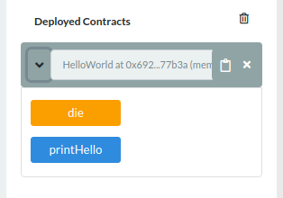

# Module 7 - Beginner Lab: [Hello-World Smart Contract][hello-world]

## Background
Smart Contracts can be implemented through the use of blockchain technology with the Ethereum network. They allow for binding agreements between network participants that are enforced by network consensus instead of a third party. This assignment looks at a simple "Hello, World!" example of Solidity, a programming language for creating Smart Contracts.

## Meta Information
| Attribute | Explanation |
| - | - |
| Summary | Create and interact with a [basic smart contract][hello-world]. |
| Topics | Solidity programming, blockchain development. |
| Audience | Appropriate for CS1 or a later course. |
| Difficulty | Completing the assignment is easy, as it is just deploying a [pre-made, hello-world contract][hello-world]. |
| Strengths | The strength of this assignment is that it allows students to get exposed to technology that they hear about often (blockchain) and is a starting point for further work. |
| Weaknesses | It may be difficult for students to extend their first smart contract. They might require more in-depth knowledge not provided here. |
| Dependencies | [Provided hello-world code][hello-world] and internet access (for use of [the Remix IDE][Remix]). |
| Variants | Could be used to introduce Smart Contracts in any course setting. |

## Assignment Instructions (10 Minutes)
1. Navigate to [Remix at remix.ethereum.org][Remix].
2. In Remix, create a new file named `hello_world.sol` by clicking the plus symbol at the top left.  
      
      
3. Copy [the code][hello-world] and paste into the newly created file in Remix.
      
4. Click on the plugin icon  in the left-most pane of Remix.  
      
5. Activate the `Deploy & Run Transactions` and `Solidity Compiler` plugins.
      
    You should see two new icons in the leftmost pane: one, the solidity compiler, looks like an "s"  and the other, deploy and run, is the ethereum symbol with an arrow to the right .  
      
6. Click the solidity compiler plugin icon .
7. Click the `Compile hello_world.sol` button and wait for compilation to complete.
      
    If all went well, you should see a check mark next to the solidity compiler icon.
      
8. Click the deploy-and-run plugin icon , and then click the orange `Deploy` button .
      
9. A smart contract, **HelloWorld** will be deployed to the blockchain.
    
10. Click the small arrow to the left of the deployed contract address to reveal the function calls available.
      
11. Click on the _printHello_ function to see the output "0: string: Hello, World".
      
12. Click on the _die_ function to remove the smart contract from the blockchain.
      
    * Note: In this case, we are not using any official blockchain, but one created within a JavaScript virtual machine to test our code.
13. Clicking on _printHello_ again afterward should give an error since the contract is dead.
    

## Credits
Dr. Debasis Bhattacharya  
Mario Canul  
Saxon Knight  
https://www.ethereum.org/greeter  

[Remix]: https://remix.ethereum.org
[hello-world]: https://github.com/UHMC/module-7-lab-beginner/blob/master/hello-world.sol
